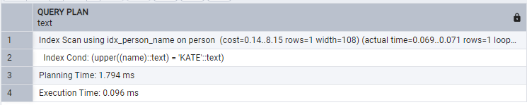

## Day 05

## Упражнение 00 - Давайте создадим индексы для каждого внешнего ключа

```sql
CREATE INDEX idx_menu_pizzeria_id ON menu USING btree (pizzeria_id);
CREATE INDEX idx_person_id ON person USING btree (id);
CREATE INDEX idx_person_order_person_id ON person_order USING btree (person_id);
CREATE INDEX idx_person_order_menu_id ON person_order USING btree (menu_id);
CREATE INDEX idx_person_visits_person_id ON person_visits USING btree (person_id);
CREATE INDEX idx_person_visits_pizzeria_id ON person_visits USING btree (pizzeria_id);
CREATE INDEX idx_pizzeria_id ON pizzeria USING btree (id);
```
# Cоздал


## Упражнение 01 - Как убедиться, что индекс работает?

```sql 
SET 
  enable_seqscan = OFF;
EXPLAIN ANALYSE 
SELECT 
  pizza_name, 
  pizzeria.name AS pizzeria_name 
FROM 
  menu 
  INNER JOIN pizzeria ON menu.pizzeria_id = pizzeria.id;
```


## Упражнение 02 — формула находится в указателе. Всё верно?

```sql 
CREATE INDEX idx_person_name ON person USING btree (
  UPPER(name)
);
SET 
  enable_seqscan = OFF;
EXPLAIN ANALYSE 
SELECT 
  * 
FROM 
  person 
WHERE 
  UPPER(name) = 'KATE';
```


## Упражнение 03 - Многоколоночный указатель для наших целей

```sql 
CREATE INDEX idx_person_order_multi ON person_order USING btree (person_id, menu_id, order_date);
SET 
  enable_seqscan = OFF;
EXPLAIN ANALYSE 
SELECT 
  person_id, 
  menu_id, 
  order_date 
FROM 
  person_order 
WHERE 
  person_id = 8 
  AND menu_id = 19;
```


## Упражнение 04 - Уникальность данных

```sql 
CREATE UNIQUE INDEX idx_menu_unique ON menu USING btree (pizzeria_id, pizza_name);
SET 
  enable_seqscan = OFF;
EXPLAIN ANALYSE 
SELECT 
  pizzeria_id, 
  pizza_name 
FROM 
  menu
```


## Упражнение 05 - Частичная уникальность данных

```sql 
CREATE UNIQUE INDEX idx_person_order_order_date ON person_order (person_id, menu_id) 
WHERE 
  order_date = '2022-01-01';
SET 
  enable_seqscan = OFF;
EXPLAIN ANALYSE 
SELECT 
  person_id, 
  menu_id 
FROM 
  person_order 
WHERE 
  order_date = '2022-01-01'
```


## Упражнение 06 - Давайте улучшим производительность

```sql
CREATE UNIQUE INDEX idx_1 ON pizzeria USING btree(rating);
SET 
  enable_seqscan = OFF;
EXPLAIN ANALYSE 
SELECT 
  m.pizza_name AS pizza_name, 
  max(rating) OVER (
    PARTITION BY rating 
    ORDER BY 
      rating ROWS BETWEEN UNBOUNDED PRECEDING 
      AND UNBOUNDED FOLLOWING
  ) AS k 
FROM 
  menu m 
  INNER JOIN pizzeria pz ON m.pizzeria_id = pz.id 
ORDER BY 
  1, 
  2;
```

