## Day 00

## Упражнение 00 - Первые шаги в мир SQL

```sql
SELECT 
  * 
FROM 
  person 
WHERE 
  address = 'Kazan'
```
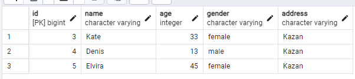


## Упражнение 01 - Первые шаги в мир SQL

```sql
SELECT 
  name, 
  age 
FROM 
  person 
WHERE 
  gender = 'female' 
  and address = 'Kazan' 
ORDER by 
  name

```
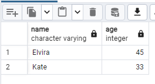

## Упражнение 02 - Первые шаги в мир SQL

#### Операторы сравнения
```sql 
SELECT 
  name, 
  rating 
FROM 
  pizzeria 
WHERE 
  rating >= '3.5' 
  AND rating <= '5' 
ORDER by 
  rating ASC

```
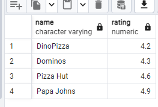

#### BETWEEN
```sql
SELECT 
  name, 
  rating 
FROM 
  pizzeria 
WHERE 
  rating BETWEEN '3.5' 
  AND '5' 
ORDER by 
  rating ASC

```
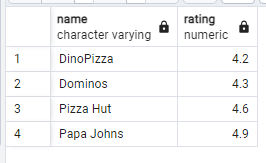

## Упражнение 03 - Первые шаги в мир SQL

```sql
SELECT 
  person_id, 
  pizzeria_id 
FROM 
  person_visits 
WHERE 
  (
    visit_date BETWEEN '2022-01-06' 
    AND '2022-01-09'
  ) 
  OR (pizzeria_id = '2') 
ORDER by 
  id ASC
```
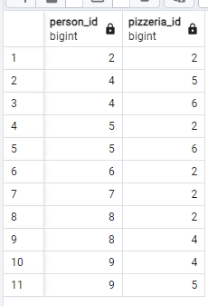

## Упражнение 04 - Первые шаги в мир SQL
 
```sql
SELECT 
  CONCAT(
    name, ' (age:', age, ',gender:''', 
    gender, ''',address:''', address, 
    ''')'
  ) AS person_person 
FROM 
  person 
ORDER BY 
  person_person ASC

```
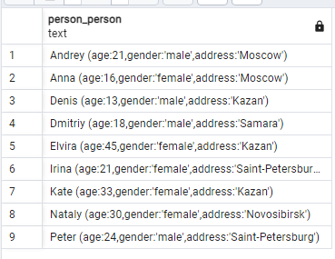

## Упражнение 05 - Первые шаги в мир SQL

```sql 
SELECT 
  name 
FROM 
  person 
WHERE 
  id IN (
    SELECT 
      person_id 
    FROM 
      person_order 
    WHERE 
      menu_id IN (13, 14, 18) 
      AND order_date = '2022-01-07'
  )
```
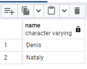

## Упражнение 06 - Первые шаги в мир SQL

```sql
SELECT 
  name, 
  CASE WHEN name = 'Denis' THEN 'true' ELSE 'false' END 
FROM 
  person 
WHERE 
  id IN (
    SELECT 
      person_id 
    FROM 
      person_order 
    WHERE 
      menu_id IN (13, 14, 18) 
      AND order_date = '2022-01-07'
  );

```
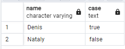 

## Упражнение 07 - Первые шаги в мир SQL

```sql
SELECT 
  id, 
  name, 
  CASE WHEN age >= 10 
  AND age <= 20 THEN 'interval #1' WHEN age > 20 
  AND age < 24 THEN 'interval #2' ELSE 'interval #3' END AS interval_info 
FROM 
  person 
ORDER BY 
  interval_info ASC;
```
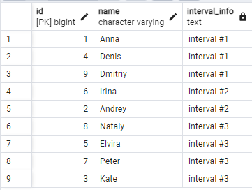

## Упражнение 08 - Первые шаги в мир SQL

```sql 
SELECT 
  * 
FROM 
  person_order 
WHERE 
  id % 2 = 0 
ORDER BY 
  id
```
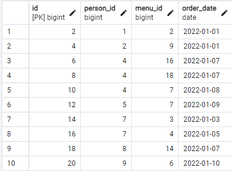 

## Упражнение 09 - Первые шаги в мир SQL

```sql
SELECT 
  (
    SELECT 
      name 
    FROM 
      person 
    WHERE 
      id = pv.person_id
  ), 
  (
    SELECT 
      pizza_name 
    FROM 
      menu 
    WHERE 
      id = pv.pizzeria_id
  ) 
FROM 
  (
    SELECT 
      * 
    FROM 
      person_visits 
    WHERE 
      visit_date BETWEEN '2022-01-07' 
      AND '2022-01-09'
  ) AS pv 
ORDER BY 
  (
    SELECT 
      name 
    FROM 
      person 
    WHERE 
      id = pv.person_id
  ) ASC, 
  (
    SELECT 
      pizza_name 
    FROM 
      menu 
    WHERE 
      id = pv.pizzeria_id
  ) DESC;
```
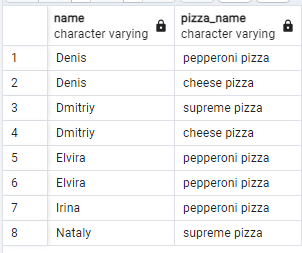 
