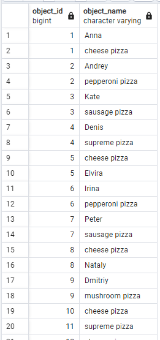
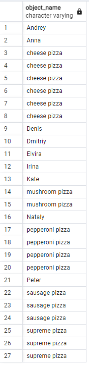
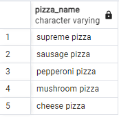
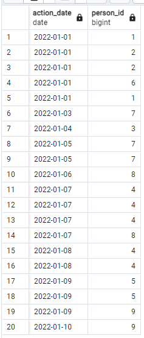
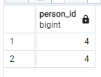
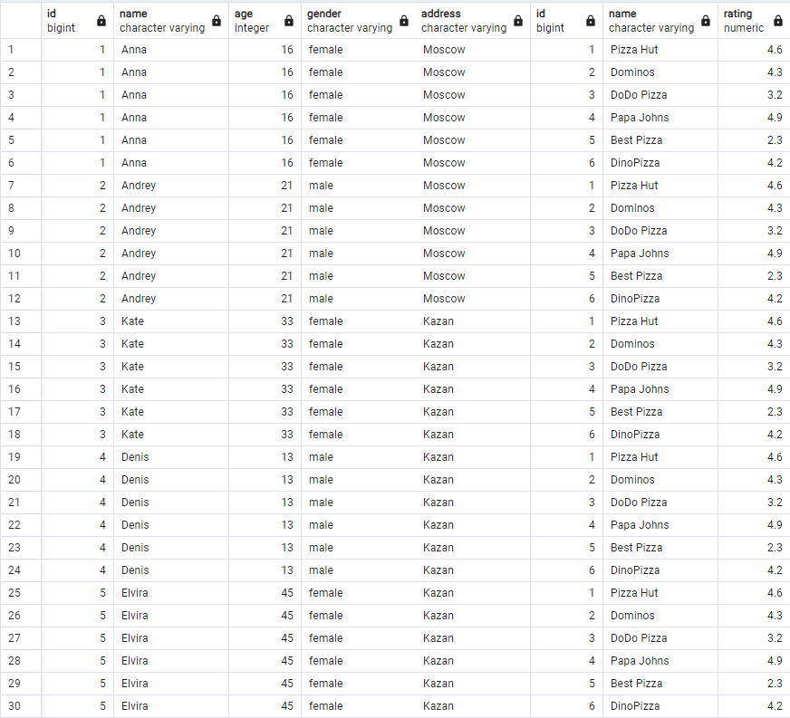
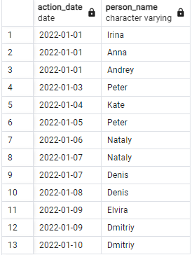
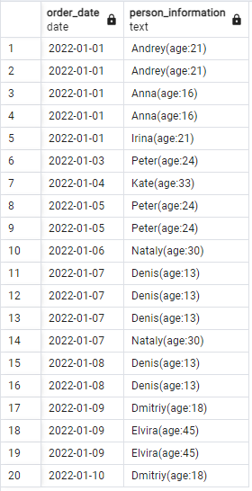
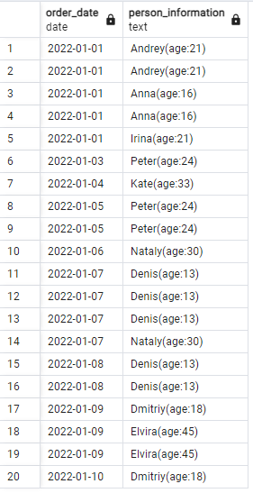
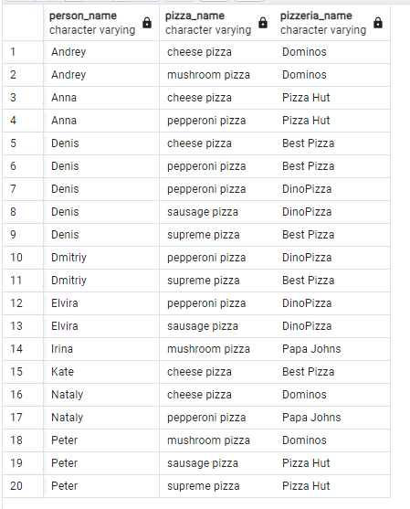

## Day 01 - Первые шаги работы с множествами и JOIN в SQL

## Упражнение 00 - Давайте заставим UNION танцевать

```sql
SELECT 
  menu.id AS object_id, 
  menu.pizza_name AS object_name 
FROM 
  menu 
UNION ALL 
SELECT 
  person.id AS object_id, 
  person.name AS object_name 
FROM 
  person 
ORDER BY 
  object_id, 
  object_name;
```


## Упражнение 01 - UNION dance с подзапросом

```sql
SELECT 
  person.name AS object_name 
FROM 
  person 
UNION ALL 
SELECT 
  menu.pizza_name AS object_name 
FROM 
  menu 
ORDER BY 
  object_name;
```


## Упражнение 02 - Дубликаты или не дубликаты

```sql
SELECT 
  pizza_name 
FROM 
  menu 
UNION 
SELECT 
  pizza_name 
FROM 
  menu 
ORDER BY 
  pizza_name DESC;
```


## Упражнение 03 - "Скрытые" инсайты

```sql
SELECT 
  order_date AS action_date, 
  person_id 
FROM 
  person_order 
WHERE 
  (person_id, order_date) IN (
    SELECT 
      person_id, 
      visit_date 
    FROM 
      person_visits
  ) 
ORDER BY 
  order_date ASC;
```


## Упражнение 04 - Разница? Да, давайте найдем разницу между мультимножествами

```sql
SELECT 
  person_id 
FROM 
  person_order 
WHERE 
  order_date = '2022-01-07' 
EXCEPT 
  ALL 
SELECT 
  person_id 
from 
  person_visits 
WHERE 
  visit_date = '2022-01-07';
```


## Упражнение 05 - Слышали ли вы о декартовом произведении?

```sql
SELECT 
  person.*, 
  pizzeria.* 
FROM 
  person, 
  pizzeria 
ORDER BY 
  person.id, 
  pizzeria.id
 ```
 

## Упражнение 06 - Давайте посмотрим на "Скрытые" Инсайты

```sql
SELECT 
  order_date AS action_date, 
  (
    SELECT 
      person.name 
    FROM 
      person 
    WHERE 
      person_order.person_id = person.id
  ) AS person_name 
FROM 
  person_order 
INTERSECT 
SELECT 
  visit_date, 
  (
    (
      SELECT 
        person.name 
      FROM 
        person 
      WHERE 
        person_visits.person_id = person.id
    )
  ) 
FROM 
  person_visits 
ORDER BY 
  action_date ASC, 
  person_name DESC;
```


## Упражнение 07 - Просто сделайте JOIN

```sql
SELECT 
  order_date, 
  person.name || ('(age:') || age || (')') AS person_information 
FROM 
  person_order 
  JOIN person ON person_order.person_id = person.id 
ORDER BY 
  order_date ASC, 
  person_information ASC;
```


## Упражнение 08 - Перенос JOIN в NATURAL JOIN

```sql 
SELECT 
  order_date, 
  name || ('(age:') || age || (')') AS person_information 
FROM 
  person_order NATURAL 
  JOIN (
    SELECT 
      id AS person_id, 
      name, 
      age 
    FROM 
      person
  ) AS id 
ORDER BY 
  order_date ASC, 
  person_information ASC;
```

## Упражнение 09 - IN против EXISTS

```sql
SELECT 
  name 
FROM 
  pizzeria 
WHERE 
  id NOT IN (
    SELECT 
      pizzeria_id 
    FROM 
      person_visits
  );


SELECT 
  pizzeria.name 
FROM 
  pizzeria 
WHERE 
  NOT EXISTS (
    SELECT 
      pizzeria_id 
    FROM 
      person_visits 
    WHERE 
      person_visits.pizzeria_id = pizzeria.id
  );
```


## Упражнение 10 - Глобальное JOIN

```sql 
SELECT 
  person.name AS person_name, 
  menu.pizza_name, 
  pizzeria.name AS pizzeria_name 
FROM 
  person 
  JOIN person_order ON person.id = person_order.person_id 
  JOIN menu ON person_order.menu_id = menu.id 
  JOIN pizzeria ON menu.pizzeria_id = pizzeria.id 
ORDER BY 
  person_name ASC, 
  menu.pizza_name ASC, 
  pizzeria_name ASC;
```

