## Day 02

## Упражнение 00

```sql
SELECT 
  name, 
  rating 
FROM 
  pizzeria 
  LEFT JOIN person_visits ON pizzeria.id = person_visits.pizzeria_id 
WHERE 
  person_visits.pizzeria_id IS NULL;
```
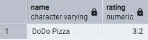

## Упражнение 01

```sql
SELECT 
  visit_date AS missing_date 
FROM 
  person_visits 
WHERE 
  (
    visit_date BETWEEN '2022-01-01' 
    AND '2022-01-10'
  ) 
GROUP BY 
  visit_date 
HAVING 
  COUNT(person_id) FILTER (
    WHERE 
      person_id = '1' 
      OR person_id = '2'
  ) = 0 
ORDER BY 
  visit_date;
```
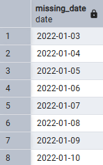

## Упражнение 02

```sql
SELECT 
  COALESCE(person.name, '-') AS person_name, 
  visit_date, 
  COALESCE(pizzeria.name, '-') AS pizzeria_name 
FROM 
  (
    SELECT 
      * 
    FROM 
      person_visits 
    WHERE 
      visit_date BETWEEN '2022-01-01' 
      AND '2022-01-03'
  ) AS date FULL 
  OUTER JOIN person ON date.person_id = person.id FULL 
  OUTER JOIN pizzeria ON date.pizzeria_id = pizzeria.id 
ORDER BY 
  person_name, 
  visit_date, 
  pizzeria_name;
```
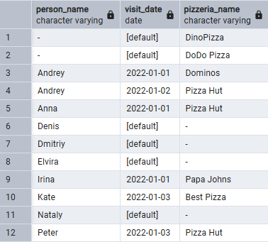

## Упражнение 03

```sql
WITH missing_dates AS (
  SELECT 
    days :: date AS missing_date 
  FROM 
    generate_series(
      '2022-01-01', '2022-01-10', interval '1 day'
    ) AS days
) 
SELECT 
  missing_date 
FROM 
  missing_dates FULL 
  JOIN (
    SELECT 
      visit_date, 
      person_id 
    FROM 
      person_visits 
    WHERE 
      person_id = 1 
      OR person_id = 2
  ) AS dates ON missing_dates.missing_date = dates.visit_date 
WHERE 
  dates.visit_date IS NULL 
ORDER BY 
  missing_date;
```
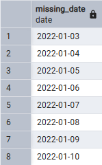

## Упражнение 04 

```sql 
with pizza AS (
  SELECT 
    * 
  FROM 
    menu 
  WHERE 
    pizza_name LIKE '%mushroom%' 
    OR pizza_name LIKE '%pepperoni%'
) 
SELECT 
  pizza_name AS pizza_name, 
  pizzeria.name AS pizzeria_name, 
  price 
FROM 
  pizza 
  JOIN pizzeria ON pizza.pizzeria_id = pizzeria.id 
ORDER BY 
  pizza_name, 
  pizzeria_name;
```
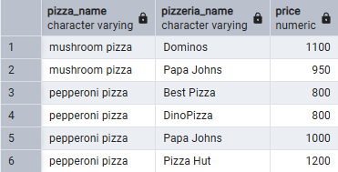

## Упражнение 05

```sql 
SELECT 
  name 
FROM 
  person 
WHERE 
  gender = 'female' 
  AND age > 25 
ORDER BY 
  name;
```
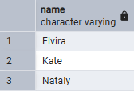

## Упражнение 06

```sql 
with couple_orders AS (
  SELECT 
    * 
  FROM 
    person_order 
    INNER JOIN person ON person_order.person_id = person.id 
  WHERE 
    person.name = 'Anna' 
    OR person.name = 'Denis'
) 
SELECT 
  pizza_name, 
  pizzeria.name AS pizzeria_name 
FROM 
  couple_orders 
  INNER JOIN menu ON couple_orders.menu_id = menu.id 
  INNER JOIN pizzeria ON menu.pizzeria_id = pizzeria.id 
ORDER BY 
  pizza_name, 
  pizzeria_name;
```
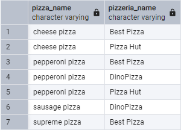

## Упражнение 07

```sql 
with satied_dmitry AS (
  SELECT 
    pizzeria.name AS pizzeria_name 
  FROM 
    person_visits 
    INNER JOIN menu ON person_visits.pizzeria_id = menu.pizzeria_id 
    INNER JOIN pizzeria ON menu.pizzeria_id = pizzeria.id 
    INNER JOIN person ON person_visits.person_id = person.id 
  WHERE 
    person.name = 'Dmitriy' 
    AND menu.price < 800 
    AND visit_date = '2022-01-08'
) 
SELECT 
  * 
FROM 
  satied_dmitry;
```
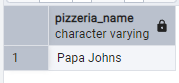

## Упражнение 08 

```sql 
with male_hunter AS (
  SELECT 
    * 
  FROM 
    person_order 
    INNER JOIN menu ON person_order.menu_id = menu.id 
    INNER JOIN person ON person_order.person_id = person.id 
  WHERE 
    person.address IN ('Moscow', 'Samara') 
    AND menu.pizza_name IN (
      'pepperoni pizza', 'mushroom pizza'
    ) 
    AND person.gender = 'male'
) 
SELECT 
  DISTINCT name 
FROM 
  male_hunter 
ORDER BY 
  name DESC;
```
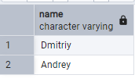

## Упражнение 09 

```sql 
WITH meaty_milf AS (
  SELECT 
    person.name AS meaty 
  FROM 
    person_order 
    INNER JOIN menu ON person_order.menu_id = menu.id 
    INNER JOIN person ON person_order.person_id = person.id 
  WHERE 
    person.gender = 'female' 
    AND pizza_name = 'pepperoni pizza'
), 
cheesy_milf AS (
  SELECT 
    person.name AS cheesy 
  FROM 
    person_order 
    INNER JOIN menu ON person_order.menu_id = menu.id 
    INNER JOIN person ON person_order.person_id = person.id 
  WHERE 
    person.gender = 'female' 
    AND pizza_name = 'cheese pizza'
) 
SELECT 
  DISTINCT name 
FROM 
  person 
  INNER JOIN meaty_milf ON person.name = meaty_milf.meaty 
  INNER JOIN cheesy_milf ON person.name = cheesy_milf.cheesy 
ORDER BY 
  name;
```
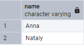

## Упражнение 10 

```sql 
with for_cross_join AS (
  SELECT 
    * 
  FROM 
    person
) 
SELECT 
  DISTINCT person.name AS person_name1, 
  for_cross_join.name AS person_name2, 
  person.address AS common_address 
FROM 
  person CROSS 
  JOIN for_cross_join 
WHERE 
  person.address = for_cross_join.address 
  AND person.name != for_cross_join.name 
  AND person.id > for_cross_join.id 
ORDER BY 
  person_name1, 
  person_name2, 
  common_address;
```
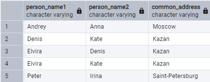