## Day 03

## Упражнение 00

```sql
SELECT 
  menu.pizza_name AS pizza_name, 
  menu.price AS price, 
  pizzeria.name AS pizzeria_name, 
  public.person_visits.visit_date AS visit_date 
FROM 
  menu 
  INNER JOIN pizzeria ON menu.pizzeria_id = pizzeria.id 
  INNER JOIN person_visits ON pizzeria.id = person_visits.pizzeria_id 
  INNER JOIN person ON person_visits.person_id = person.id 
WHERE 
  person.name = 'Kate' 
  AND menu.price BETWEEN 800 
  AND 1000 
ORDER BY 
  pizza_name, 
  price, 
  pizzeria_name;
```
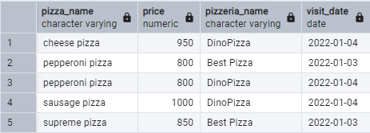

## Упражнение 01 

```sql 
SELECT 
  id AS menu_id 
FROM 
  menu 
EXCEPT 
SELECT 
  person_order.menu_id 
FROM 
  person_order 
ORDER BY 
  menu_id;
```
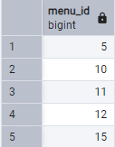

## Упражнение 02

```sql 
SELECT 
  menu.pizza_name AS pizza_name, 
  menu.price AS price, 
  pizzeria.name AS pizzeria_name 
FROM 
  menu 
  INNER JOIN pizzeria ON menu.pizzeria_id = pizzeria.id 
  LEFT JOIN person_order ON menu.id = person_order.menu_id 
WHERE 
  person_order.menu_id IS NULL 
ORDER BY 
  pizza_name, 
  price;
```
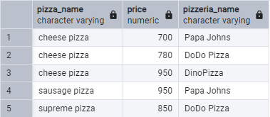

## Упражнение 03 

```sql 
WITH diff AS (
  SELECT 
    pizzeria.name AS pizzeria_name, 
    ABS(
      COUNT(*) FILTER (
        WHERE 
          person.gender = 'male'
      ) - COUNT(*) FILTER (
        WHERE 
          person.gender = 'female'
      )
    ) AS diff_col 
  FROM 
    pizzeria 
    INNER JOIN person_visits ON pizzeria.id = person_visits.pizzeria_id 
    INNER JOIN person ON person_visits.person_id = person.id 
  GROUP BY 
    pizzeria.name
) 
SELECT 
  pizzeria_name 
FROM 
  diff 
WHERE 
  diff_col > 0 
ORDER BY 
  pizzeria_name;
```
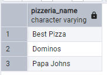

## Упражнение 04 

```sql 
WITH man_choise AS (
  SELECT 
    pizzeria.name AS pizzeria_name, 
    COUNT(*) FILTER (
      WHERE 
        person.gender = 'female'
    ) AS counter 
  FROM 
    person 
    INNER JOIN person_order ON person.id = person_order.person_id 
    INNER JOIN menu ON person_order.menu_id = menu.id 
    INNER JOIN pizzeria ON menu.pizzeria_id = pizzeria.id 
  GROUP BY 
    pizzeria.name 
  HAVING 
    COUNT(*) FILTER (
      WHERE 
        person.gender = 'female'
    ) = 0
), 
female_choise AS (
  SELECT 
    pizzeria.name AS pizzeria_name, 
    COUNT(*) FILTER (
      WHERE 
        person.gender = 'male'
    ) AS counter 
  FROM 
    person 
    INNER JOIN person_order ON person.id = person_order.person_id 
    INNER JOIN menu ON person_order.menu_id = menu.id 
    INNER JOIN pizzeria ON menu.pizzeria_id = pizzeria.id 
  GROUP BY 
    pizzeria.name 
  HAVING 
    COUNT(*) FILTER (
      WHERE 
        person.gender = 'male'
    ) = 0
) 
SELECT 
  pizzeria_name 
FROM 
  man_choise 
UNION 
SELECT 
  pizzeria_name 
FROM 
  female_choise;
```


## Упражнение 05

```sql
SELECT 
  pizzeria.name AS pizzeria_name 
FROM 
  person_visits 
  LEFT JOIN person_order ON person_visits.person_id = person_order.person_id 
  AND person_visits.visit_date = person_order.order_date 
  INNER JOIN person ON person_visits.person_id = person.id 
  INNER JOIN pizzeria ON person_visits.pizzeria_id = pizzeria.id 
WHERE 
  (person_order.person_id IS NULL) 
  AND person.name = 'Andrey';
```


## Упражнение 06 

```sql 
SELECT 
  menu.pizza_name AS pizza_name, 
  p1.name AS pizzeria_name_1, 
  p2.name AS pizzeria_name_2, 
  menu.price AS price 
FROM 
  menu 
  INNER JOIN pizzeria AS p1 ON menu.pizzeria_id = p1.id CROSS 
  JOIN menu AS m2 
  INNER JOIN pizzeria AS p2 ON m2.pizzeria_id = p2.id 
WHERE 
  menu.pizza_name = m2.pizza_name 
  AND m2.id < menu.id 
  AND menu.price = m2.price;
```
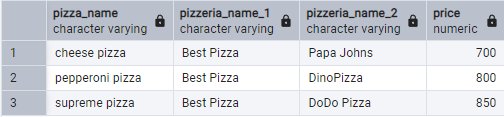

## Упражнение 07 

```sql 
INSERT INTO menu 
VALUES 
  (19, 2, 'greek pizza', 800);
SELECT 
  * 
FROM 
  menu 
WHERE 
  id = 19;
```
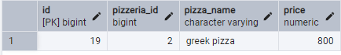

## Упражнение 08 

```sql 
INSERT INTO menu 
VALUES 
  (
    (
      SELECT 
        COALESCE(
          MAX(id), 
          0
        ) + 1 
      FROM 
        menu
    ), 
    (
      SELECT 
        id 
      FROM 
        pizzeria 
      WHERE 
        name = 'Dominos'
    ), 
    'sicilian pizza', 
    900
  );
SELECT 
  * 
FROM 
  menu 
WHERE 
  id = 20;
```
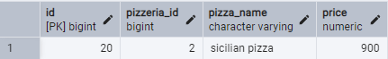

## Упражнение 09 

```sql 
INSERT INTO person_visits (
  id, person_id, pizzeria_id, visit_date
) 
VALUES 
  (
    (
      SELECT 
        COALESCE(
          MAX(id), 
          0
        ) + 1 
      FROM 
        person_visits
    ), 
    (
      SELECT 
        id 
      FROM 
        person 
      WHERE 
        name = 'Denis'
    ), 
    (
      SELECT 
        id 
      FROM 
        pizzeria 
      WHERE 
        name = 'Dominos'
    ), 
    '2022-02-24'
  );
INSERT INTO person_visits (
  id, person_id, pizzeria_id, visit_date
) 
VALUES 
  (
    (
      SELECT 
        COALESCE(
          MAX(id), 
          0
        ) + 1 
      FROM 
        person_visits
    ), 
    (
      SELECT 
        id 
      FROM 
        person 
      WHERE 
        name = 'Irina'
    ), 
    (
      SELECT 
        id 
      FROM 
        pizzeria 
      WHERE 
        name = 'Dominos'
    ), 
    '2022-02-24'
  );
SELECT 
  person.name, 
  pizzeria.name, 
  visit_date 
FROM 
  person_visits 
  INNER JOIN person ON person_visits.person_id = person.id 
  INNER JOIN pizzeria ON person_visits.pizzeria_id = pizzeria.id 
WHERE 
  visit_date = '2022-02-24'
```
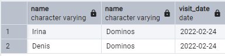

## Упражнение 10 

```sql 
INSERT INTO person_order 
VALUES 
  (
    (
      SELECT 
        COALESCE(
          MAX(id), 
          0
        ) + 1 
      FROM 
        person_order
    ), 
    (
      SELECT 
        id 
      FROM 
        person 
      WHERE 
        name = 'Denis'
    ), 
    (
      SELECT 
        id 
      FROM 
        menu 
      WHERE 
        pizza_name = 'sicilian pizza'
    ), 
    '2022-02-24'
  );
INSERT INTO person_order 
VALUES 
  (
    (
      SELECT 
        COALESCE(
          MAX(id), 
          0
        ) + 1 
      FROM 
        person_order
    ), 
    (
      SELECT 
        id 
      FROM 
        person 
      WHERE 
        name = 'Irina'
    ), 
    (
      SELECT 
        id 
      FROM 
        menu 
      WHERE 
        pizza_name = 'sicilian pizza'
    ), 
    '2022-02-24'
  );
SELECT 
  person.name, 
  menu.pizza_name, 
  order_date 
FROM 
  person_order 
  INNER JOIN person ON person_order.person_id = person.id 
  INNER JOIN menu ON person_order.menu_id = menu.id 
WHERE 
  order_date = '2022-02-24'
```
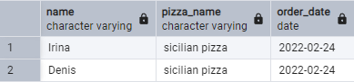

## Упражнение 11

```sql
UPDATE 
  menu 
SET 
  price = (
    SELECT 
      price 
    FROM 
      menu 
    WHERE 
      pizza_name = 'greek pizza'
  ) * 0.9 
WHERE 
  pizza_name = 'greek pizza';
SELECT 
  800 * 0.9 = price AS checker 
FROM 
  menu 
WHERE 
  pizza_name = 'greek pizza';
```


## Упражнение 12

```sql 
WITH ids AS (
  SELECT 
    generate_series(
      1, 
      (
        SELECT 
          COUNT(*) 
        FROM 
          person
      )
    ) AS temp_id, 
    generate_series(
      (
        SELECT 
          MAX(id) 
        FROM 
          person_order
      ) + 1, 
      (
        (
          SELECT 
            MAX(id) 
          FROM 
            person_order
        ) + (
          SELECT 
            COUNT(*) 
          FROM 
            person
        )
      ), 
      1
    ) AS id
) INSERT INTO person_order (
  id, person_id, menu_id, order_date
) 
SELECT 
  ids.id, 
  person.id, 
  (
    SELECT 
      id 
    FROM 
      menu 
    WHERE 
      pizza_name = 'greek pizza'
  ) AS menu_id, 
  '2022-02-25' AS order_date 
FROM 
  ids 
  JOIN person ON ids.temp_id = person.id;
SELECT 
  person.name, 
  menu.pizza_name, 
  order_date 
FROM 
  person_order 
  JOIN person ON person_order.person_id = person.id 
  JOIN menu ON person_order.menu_id = menu.id 
WHERE 
  order_date = '2022-02-25';
```
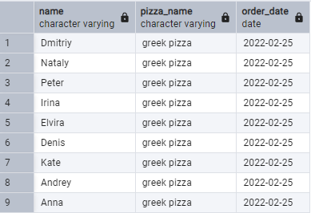

## Упражнение 13

```sql
DELETE FROM 
  person_order 
WHERE 
  order_date = '2022-02-25';
DELETE FROM 
  menu 
WHERE 
  pizza_name = 'greek pizza';
SELECT 
  * 
FROM 
  person_order 
WHERE 
  order_date = '2022-02-25';
SELECT 
  * 
FROM 
  menu 
WHERE 
  pizza_name = 'greek pizza';
```
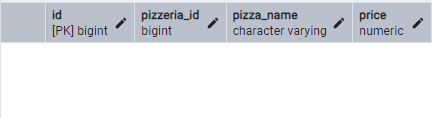
