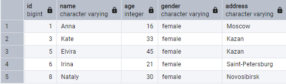
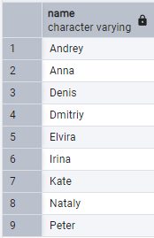
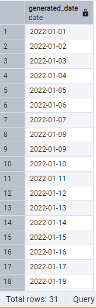
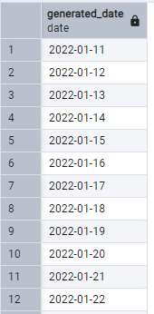
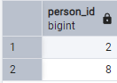
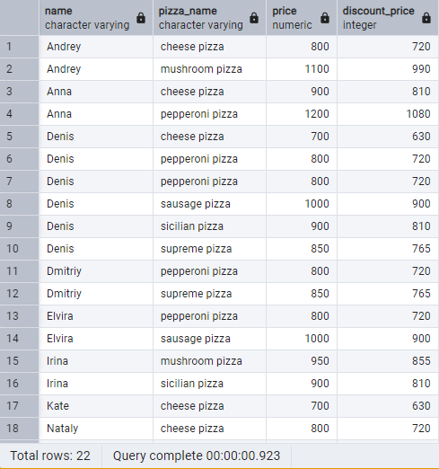
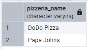
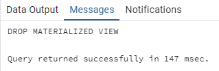

## Day 04

## Упражнение 00 - Давайте создадим отдельные представления для лиц

```sql
CREATE VIEW v_persons_female AS (
  SELECT 
    * 
  FROM 
    person 
  WHERE 
    person.gender = 'female'
);
CREATE VIEW v_persons_male AS (
  SELECT 
    * 
  FROM 
    person 
  WHERE 
    person.gender = 'male'
);
SELECT 
  * 
FROM 
  v_persons_male;
SELECT 
  * 
FROM 
  v_persons_female;
```


## Упражнение 01 - От деталей к общему виду

```sql
SELECT 
  name 
FROM 
  v_persons_male 
UNION 
SELECT 
  name 
FROM 
  v_persons_female 
ORDER BY 
  name;
```


## Упражнение 02 — «Сохраните» сгенерированные даты в одном месте

```sql
CREATE VIEW v_generated_dates AS (
  SELECT 
    generate_series(
      '2022-01-01', '2022-01-31', interval '1 day'
    ):: date AS generated_date 
  ORDER BY 
    generated_date
);
SELECT 
  * 
FROM 
  v_generated_dates;
```


## Упражнение 03 - Найдите пропущенные дни посещения с помощью представления базы данных

```sql 
SELECT 
  * 
FROM 
  v_generated_dates 
EXCEPT 
SELECT 
  person_visits.visit_date 
FROM 
  person_visits 
ORDER BY 
  generated_date
```


## Упражнение 04 - Давайте найдем что-нибудь из Теории множеств

```sql 
CREATE VIEW v_symmetric_union AS (
  SELECT 
    person_id 
  FROM 
    person_visits 
  WHERE 
    visit_date = '2022-01-02' 
  UNION 
  SELECT 
    person_id 
  FROM 
    person_visits 
  WHERE 
    visit_date = '2022-01-06' 
  ORDER BY 
    person_id
);
SELECT 
  * 
FROM 
  v_symmetric_union
```


## Упражнение 05 - Давайте рассчитаем цену со скидкой для каждого человека

```sql 
CREATE VIEW v_price_with_discount AS (
  SELECT 
    person.name AS name, 
    menu.pizza_name AS pizza_name, 
    menu.price AS price, 
    ROUND(menu.price * 0.9, 0):: int AS discount_price 
  FROM 
    person_order 
    INNER JOIN person ON person_order.person_id = person.id 
    INNER JOIN menu ON person_order.menu_id = menu.id 
  ORDER BY 
    name, 
    pizza_name
);
SELECT 
  * 
FROM 
  v_price_with_discount
```


## Упражнение 06 - Материализация из виртуализации

```sql 
CREATE MATERIALIZED VIEW mv_dmitriy_visits_and_eats AS (
  SELECT 
    pizzeria.name AS pizzeria_name 
  FROM 
    person_visits 
    INNER JOIN menu ON person_visits.pizzeria_id = menu.pizzeria_id 
    INNER JOIN person ON person_visits.person_id = person.id 
    INNER JOIN pizzeria ON person_visits.pizzeria_id = pizzeria.id 
  WHERE 
    visit_date = '2022-01-08' 
    AND person.name = 'Dmitriy' 
    AND menu.price < 800
);
SELECT 
  * 
FROM 
  mv_dmitriy_visits_and_eats
```


## Упражнение 07 - Обновите наше состояние

```sql 
INSERT INTO person_visits(
  id, person_id, pizzeria_id, visit_date
) 
VALUES 
  (
    (
      SELECT 
        COALESCE(
          MAX(id), 
          0
        ) + 1 
      FROM 
        person_visits
    ), 
    (
      SELECT 
        id 
      FROM 
        person 
      WHERE 
        person.name = 'Dmitriy'
    ), 
    (
      SELECT 
        pizzeria_id 
      FROM 
        menu 
      WHERE 
        price < 800 
      LIMIT 
        1
    ), '2022-01-08'
  );
REFRESH MATERIALIZED VIEW mv_dmitriy_visits_and_eats;
SELECT 
  * 
FROM 
  mv_dmitriy_visits_and_eats;
```


## Упражнение 08 - Просто очистите нашу базу данных

```sql 
DROP 
  VIEW v_persons_female;
DROP 
  VIEW v_persons_male;
DROP 
  VIEW v_generated_dates;
DROP 
  VIEW v_symmetric_union;
DROP 
  VIEW v_price_with_discount;
DROP 
  MATERIALIZED VIEW mv_dmitriy_visits_and_eats;
```

